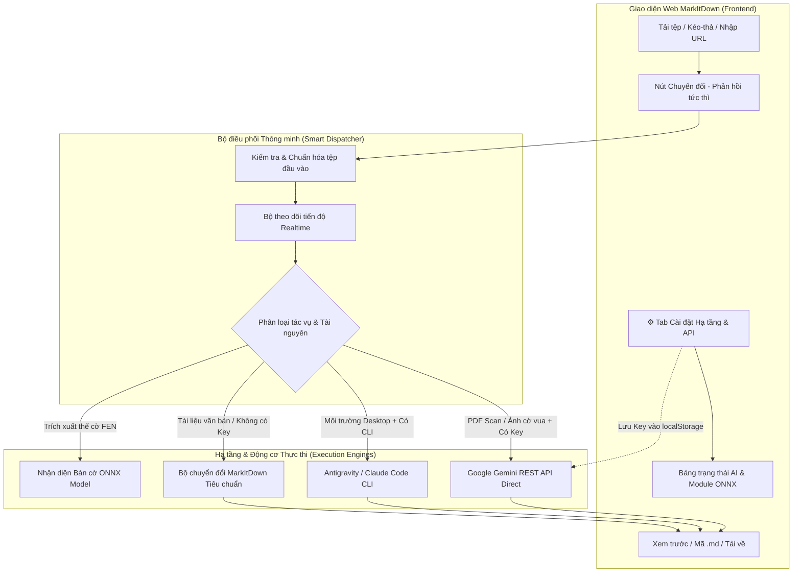

# Kế hoạch Triển khai Trung tâm Cài đặt Hạ tầng & Cấu hình AI (MarkItDown Web)

> **Mục tiêu:** Bổ sung Trung tâm Cài đặt Hạ tầng & Cấu hình AI (Infrastructure Setup Center) trực tiếp trên giao diện Web MarkItDown, cung cấp công cụ kiểm tra kết nối API thời gian thực, hiển thị bảng trạng thái hệ thống trực quan, và tối ưu hóa phản hồi tương tác tức thì khi người dùng bấm nút "Chuyển đổi" để loại bỏ hoàn toàn cảm giác "không có tín hiệu gì".

---

## 1. Tổng quan Kiến trúc & Luồng xử lý

---

## 2. Chi tiết các hạng mục triển khai

### Hạng mục 1: Xây dựng Module Quản lý & Kiểm tra Hạ tầng (`infrastructure.py`)
- **Kiểm tra API Key thời gian thực (`test_gemini_connection`)**: Gửi yêu cầu kiểm tra ping siêu nhẹ tới Google Gemini API (`gemini-2.5-flash` / `gemini-3.7-flash`), đo đạc độ trễ phản hồi (latency ms) và xác nhận tính hợp lệ của API Key.
- **Tổng hợp trạng thái toàn diện (`get_infrastructure_status`)**:
  - Trạng thái AI Engine (Gemini REST API / Antigravity CLI / Claude CLI).
  - Trạng thái mô hình ONNX nhận diện bàn cờ (`chessboard_fen.onnx`).
  - Trạng thái thư viện xử lý tài liệu (`pypdfium2`, `pdfminer`, `exiftool`, `ffmpeg`).
  - Môi trường thực thi (`Docker/Linux VPS` hoặc `Windows Desktop`).

### Hạng mục 2: Bổ sung Tab "⚙️ Cài đặt Hạ tầng & API" trên Giao diện Web (`markitdown_gui.py`)
- **Khu vực Cấu hình API Key**:
  - Ô nhập **Google Gemini API Key** (hỗ trợ ẩn/hiện key).
  - Nút **"🔍 Kiểm tra kết nối"** -> Ngay lập tức hiển thị huy hiệu trạng thái: `✅ Kết nối thành công (280ms) — Đã sẵn sàng OCR & Dịch!` hoặc `❌ API Key không hợp lệ: [Chi tiết lỗi]`.
  - Tự động lưu vào `BrowserState` (`localStorage`) để ghi nhớ vĩnh viễn trên trình duyệt của người dùng.
- **Bảng Trạng thái Hạ tầng (Infrastructure Status Cards)**: Hiển thị trạng thái các module cốt lõi dạng thẻ trực quan (Xanh: Sẵn sàng, Vàng: Khuyên dùng cấu hình, Đỏ: Thiếu phụ thuộc).
- **Khung Hướng dẫn 1 phút**: Cung cấp đường dẫn bấm thẳng tới [Google AI Studio](https://aistudio.google.com/app/apikey) để người dùng lấy API Key miễn phí chỉ trong 30 giây.

### Hạng mục 3: Nâng cấp Trải nghiệm Phản hồi Tức thì (Instant Feedback) khi Chuyển đổi
- **Phản hồi tức thì ngay khi Click**:
  - Khi người dùng bấm **"Chuyển đổi"**, nút lập tức đổi sang nhãn `⏳ Đang xử lý...` (vô hiệu hóa tạm thời để tránh bấm đúp).
  - Khu vực trạng thái lập tức cập nhật: `🚀 Đang đọc tệp và khởi động bộ chuyển đổi...`.
  - Tích hợp thanh tiến trình `gr.Progress` hiển thị theo thời gian thực.
- **Cơ chế Fallback & Báo cáo Thông minh**:
  - **Tài liệu văn bản (Word, Excel, PowerPoint, HTML, PDF văn bản)**: Chuyển đổi cực nhanh bằng MarkItDown core.
  - **PDF Scan / Ảnh cờ vua**:
    - Nếu đã cấu hình API Key: Tự động OCR nhận diện bàn cờ, xuất mã FEN, dịch sang tiếng Việt và đóng gói file tải về.
    - Nếu chưa có API Key: Tự động trích xuất nội dung tiêu chuẩn và hiển thị thông báo hướng dẫn rõ ràng: `💡 Mẹo: Nhập Gemini API Key tại tab "Cài đặt Hạ tầng" để kích hoạt OCR nhận diện bàn cờ và dịch thuật tiếng Việt.`

### Hạng mục 4: Triển khai lên VPS qua Dokploy & Kiểm thử Thực tế
- Commit & Push mã nguồn lên GitHub `covuaduongsinh/markitdown`.
- Kích hoạt Dokploy tự động build và deploy lên `https://markitdown.dsc.edu.vn`.
- Chạy kịch bản kiểm thử End-to-End từ xa trên VPS để đảm bảo mọi luồng hoạt động mượt mà.

---

## 3. Kế hoạch Kiểm thử & Tiêu chí Nghiệm thu

| Trường hợp kiểm thử | Kỳ vọng đạt được |
| :--- | :--- |
| **Bấm nút Chuyển đổi khi chưa có tệp** | Lập tức hiển thị thông báo màu cam nhắc nhở chọn tệp |
| **Bấm nút Chuyển đổi khi có tệp** | Nút đổi trạng thái `⏳ Đang xử lý...` ngay lập tức, tiến trình cập nhật liên tục |
| **Nhập Gemini API Key & Test** | Bấm "Kiểm tra kết nối" trả về kết quả `✅ Kết nối thành công (Latency ms)` trong < 1s |
| **Chuyển đổi tệp thường (không có Key)** | Xuất kết quả Markdown và bảng tải về `.md` trơn tru |
| **Chuyển đổi tệp cờ vua (có Key)** | Xuất bản gốc `.md`, bản dịch tiếng Việt `_vn.md`, và tệp thế cờ `_fen.txt` |
